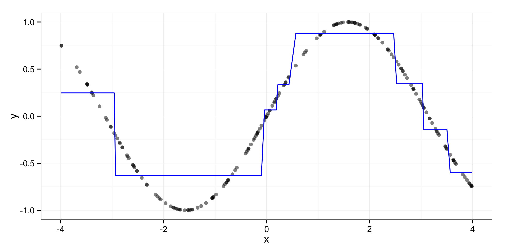
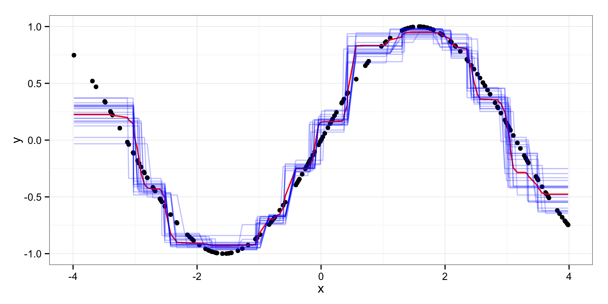
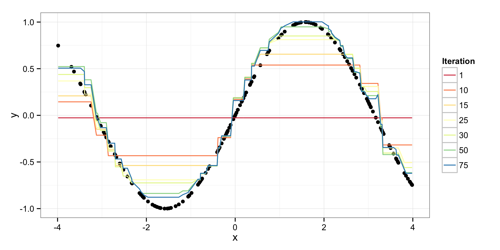
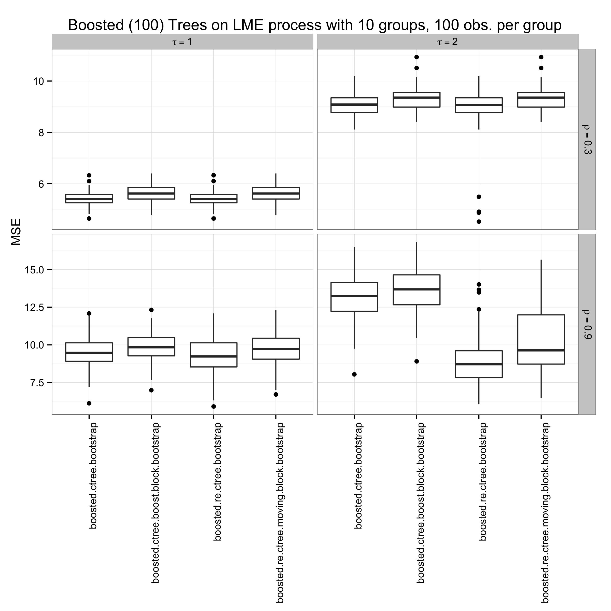

% Ensembles of Conditional Inference Trees for Dependent Data
% Zachary M. Jones

\begin{abstract}
Historical data in political science is of interest to political scientists that want to discover reliable patterns in the data. Nonparametric statistical learning methods are ideal for this task but do not make use of the nested dependent structure of such data. One such statistical learning method are regression trees, which are a piecewise-constant recursive function approximation method. They can be combined into ensembles that have lower bias and/or variance predictions by combining predictions from trees grown on resampled replicates of the data and by boosting. These methods: bootstrap aggregated regression trees and stochastic boosting (with regression trees) are combined with a linear mixed effects model which iteratively separates variation into the outcome into fixed and random effects. Predictive performance is demonstrated using synthetic data and an example data set from the literature on state repression. Implementations of several resampling methods for dependent data, random effects regression trees, and stochastically boosted regression trees with random effects are provided in \texttt{R}.
\end{abstract}

## Introduction

In political science historical data is often analyzed with the goal of discovering patterns in the data. Patterns in the data may agree or disagree with extant theory in ways that move understanding of the dynamics of the political system in question, or suggest new phenomena in need of explanation (e.g., @hill2014empirical). This is exploratory data analysis: description of the data at hand in an interpretable manner. Without care, however, it is easy to identify patterns that are artifacts of measurement, do not persist over time or space to a degree sufficient to warrant theory building, or are the result of assumptions in the model specification that are not empirically defensible. This is commonly referred to as over-fitting and it manifests as a substantial difference between error on data that was used to fit a model and error on data that was not used to fit the model. Statistical learning, and in particular methods that rely on adaptive basis functions such as classification, regression, and survival trees, generalized additive models, and feedforward neural networks are increasingly used in political science for exploratory data analysis because they are ideally suited for finding patterns in complex data while guarding against overfitting [@hill2014empirical; @hainmueller2013kernel; @beck2000improving; @beck1998beyond].

Many statistical learning methods are, however, not ideally suited for use on complex historical data, which is often highly dependent. Data that are measured annually at the national level for example are dependent over time within states, across states that are "close" in various types of social networks (e.g., alliance networks and trade networks), and across space. Statistical learning methods which assume data are independent and identically distributed often do well at predicting such data as a function of predictors since this dependence is often a function of observable variables. However, when latent dependence remains predictions are suboptimal: they could be improved by using the structure of the data to partition into idiosyncratic variation and variation that is due to latent group structures in the data.

## Classification and Regression Trees

Consider the case in which $\mathbf{y}$ is a real-valued vector of length $n$ measuring some phenomena of interest, and $\mathbf{X}$ is an $n \times k$ matrix of predictors. Classification and regression trees (CART) offer an attractive way to nonparametrically estimate a moment of the conditional distribution of $\mathbf{y} | \mathbf{X}$ by assuming that $\mathbf{y} = f(\mathbf{X})$ and that $f(\cdot)$ can be approximated by a piecewise constant function [@breiman1984classification].

Take for example the bivariate case with one predictor $\mathbf{x} \sim U(-4, 4)$ and $\mathbf{y} = \sin(\mathbf{x})$. The sine function is approximated by using the mean of $\mathbf{x}$ in an adaptive neighborhood as shown in Figure \ref{fig:cart_approximation}.

This approximation is generated by recursive partitioning: splitting the data into subsets homogenous in $\mathbf{y}$ using $\mathbf{X}$. By defining "homogenous" using loss functions such as quadratic loss, misclassification loss, or Gini Impurity, this splitting procedure can be used on outcomes measured at many different scales. In the canonical implementation of CART the algorithm works by exhaustively searching over the unique values of the predictors and finding the value in the set of predictors which maximizes the reduction in loss by splitting. The gain is defined as the difference in the loss $L(\cdot)$ in the current partition and the sum of the losses in the partitions on either side of the proposed split in the selected variable $\mathbf{x}_s$ denoted $c \in \mathbf{x}_s$. $n^{(r)}$ and $n^{(l)}$ are the number of observations that fall to the right and left of the cutpoint $c$.

$$\Delta_{c}(\mathbf{x}_s) = L(\mathbf{y}) - \left[\frac{n^{(l)}}{n} L(\mathbf{y}^{(l)}) +  \frac{n^{(r)}}{n} L(\mathbf{y}^{(r)})\right]$$.

In this algorithm recursion in a partition stops when the null hypothesis of independence between $\mathbf{y}$ and $\mathbf{X}$ can no longer be rejected at a level determined by the family-wise error rate.

As shown in @hothorn2006unbiased, this leads to a bias towards splitting on variables with more potential split points (unique values) in the null case that no $\mathbf{X}$ and $\mathbf{y}$ are independent. @hothorn2006unbiased propose and implement an alternative algorithm: the conditional inference tree. Comparing predictors measured at different scales is accomplished by computing a linear test statistic $T(\mathbf{x})$ that measures the relationship between $\mathbf{x}$ and $\mathbf{y}$. The permuation distribution of this statistic under the null hypothesis of independence is known, and probabilities can be computed directly, allowing comparison of predictors on the $p$-scale [@strasser1999asymptotic]. This results in unbiased recursive partitionining in the sense that when no predictors have any relation to the outcome, splitting on any predictor is equiprobable.

The algorithm first selects the predictor most strongly related to the outcome using the above method and then finds the split which maximizes the gain (decrease in loss).

## Random Effects Regression Tree Algorithm

@sela2012re propose the following algorithm.

 0. initialize $\mathbf{y}^* = \mathbf{y}$, $\mathbf{b} = \mathbf{0}$
 1. estimate $\hat{f}$ using $y_{it}^* = f(\mathbf{x}_{it}), \; i = (1, \ldots, n)$ and $t = (1, \ldots, T_i)$ with a regression tree
 2. fit the linear mixed effects model $y_{it} = \sum_{p=1}^P \mu_p \mathbb{I}(\mathbf{x}_{it} \in g_p) + Z_{it} \mathbf{b}_i + \epsilon_{it}$ where $\mathbf{g}$ are the terminal nodes from (1)
 3. set $\mathbf{y}^* = \mathbf{y} - \mathbf{Z} \hat{\mathbf{b}}$
 4. iterate (1-3) until the change in the restricted log-likelihood of (2) is less than a tolerance
 5. fitted values for groups observed in the learning sample are $\sum_{p=1}^P \text{ave}(y_{it} | \mathbf{x}_{it} \in g_p) + Z_{it} \hat{\mathbf{b}}_i$ otherwise only the fixed effect is used

This algorithm is similar to expectation maximization (EM) algorithms in that in (1) the random effects are assumed known, and the fixed effects are estimated. In (2) the fixed effects are assumed known and the random effects are estimated. The random effects are then removed and the residualized outcome is used to estimate the fixed effects again. The implementation of @sela2012re relies on the faster but biased CART algorithm of @breiman1984classification rather than that of @hothorn2006unbiased. I reimplement this algorithm using the above described conditional inference trees, which has been also been independently done by Fu and Siminoff, which show via simulations that the combination of the algorithm of @sela2012re and the conditional inference trees of @hothorn2006unbiased retains the unbiasedness (in the sense of equal probability of splitting on variables in the null case of independence between the predictors and outcome) of the latter algorithm (the source for this is not yet publically available).

## Ensembles

Classification and regression trees have several properties that make them less than optimal for many tasks. Without an optimal choice of stopping criteria or pruning trees can overfit. Second, trees are high variance estimators of $f(\cdot)$. For these reasons trees are commonly used as base learners in ensembles that reduce variance or bias to produce estimates of $f(\cdot)$ that have better properties.

### Bagging

One of the first ensemble of tree methods that was developed is bootstrap aggregating, or bagging [@breiman1996bagging]. The data are resampled repeatedly, and a tree is fit to each sample. Predictions are then the average of the trees' predictions across all samples. Usually each tree's prediction is made using the out-of-bag (OOB) data, which is the data that is not in the sample used to fit said tree. Two common resampling methods used are the boostrap [@efron1979bootstrap; @efron1994introduction] and subsampling [@politis1999weak]. Using these resampling methods on dependent data breaks the covariance structure of the data and results in underestimates of generalization error when there is positive covariance between observations.

Bagging with dependent data can be done more effectively using resampling methods for dependent data such as the block bootstrap and the moving block bootstrap. The algorithm of @sela2012re implemented with conditional inference trees can be combined with dependent data resampling methods to reduce the variance of estimates of $f(\cdot)$.

The block bootstrap is appropriate when there is a single grouping structure in the data which constitutes a block. Observations may be correlated within blocks (due to a random or fixed effect constant within groups) but are independent across blocks. Resampling can be accomplished by sampling blocks with replacement. The moving block bootstrap works by considering all possible sets of adjacent observations of size $l$, which may overlap. $k$ blocks of size $l$ such that $k \times l \approx n$ are sampled with replacement. This method is appropriate for non-nested data in which autocorrelation is of order less than $l$ such that non-overlapping blocks are uncorrelated. Both are implemented but only the latter is used in the simulation below.

### Boosting

Boosting is an ensemble method that reduces bias by iteratively fitting reweighted training data [@freund1995desicion]. Gradient boosting is an analogue of gradient descent in function space (FGD) [@friedman2001greedy; @buhlmann2007boosting]. Given a differentiable loss function $L(\cdot)$ such as quadratic loss $\frac{1}{2}|y - f|^2$, and a base learner, such as a regression or classification tree, the data are iteratively fit using the base learner applied to an approximation of the negative gradient ($\hat{f}(\cdot)$). Intuitively this is minimizing $L(\cdot)$ by following the steepest descent: which amounts to upweighting training data that was not fit well at the previous iterate. With quadratic loss this results in sequentially fitting the residuals from the previous iterate [@buhlmann2003boosting].

The generic FGD algorithm works as follows:

1. Initialize $\hat{f}^{(m = 0)}$ to an offset value such as $\text{arg}_c \text{min} \frac{1}{n}\sum_{i=1}^n L(\mathbf{y}, c)$ where $c$ is a constant
2. Compute $\mathbf{u} = -\frac{\partial L}{\partial f} L(\mathbf{y}, f(\mathbf{X}))|_{f = \hat{f}^{(m - 1)}(\mathbf{X})}$
3. Fit $\mathbf{u} = \hat{g}^{(m)}(\mathbf{X})$ using the base learner
4. Update $\hat{f}^{(m)} = \hat{f}^{(m-1)}(\cdot) + v \hat{g}^{(m)}(\cdot)$ where $v$ is a step-size often referred to as the learning rate
5. Repeat (2-4) until a stopping criteria is met

Step (4) can be reexpressed as $\hat{f}^{(m)}(\cdot) = \sum_{i=1}^m v \hat{g}^{(i)}(\cdot)$. When $L(\cdot)$ is the quadratic loss the offset value is typically the mean, and the negative gradient evaluated at the training data is the residuals. The base learner is often a shallow regression tree which has high bias but low variance [@buhlmann2007boosting]. The depth of the tree determines the depth of interaction detectable by the ensemble. Gradient boosting of this sort can be combined with the random effects conditional inference tree algorithm outlined in previous sections by using random effects conditional inference trees as base learners, or by using boosted conditional inference trees in place of regression trees in the aforementioned random effects conditional inference tree algorithm. The latter option is preferable for computational reasons.

Boosting algorithms have two main tuning parameters: the learning rate $v$ and the number of iterations $m$. With trees as base learners there are additional tuning parameters such as the maximal depth of the tree. The maximum iterations $m$ can be arbitrarily set or tuned using cross-validation. In general as $m$ increases $v$ must decrease to maintain the same training error.

An additional improvement to gradient boosting comes from reducing variance by using resampling methods: stochastic gradient boosting [@friedman2002stochastic]. At each iterate the base learner is fit to a psuedo-dataset comprised of the negative gradient evaluated at a resampled version of the training data. As outlined in the description of bagging, this can be done with any sort of resampling procedure. Here I evaluate the performance of this boosting algorithm with a moving block bootstrap.

## Simulation

To study the performance of bagged random effects conditional inference regression trees and the combination of stochastic boosting using conditional inference regression trees and a linear mixed effects model I generate data from a linear mixed effects model.

$$y_{ij} = \alpha_j + \sum_{k = 1}^5 \beta_k x_{ijk} + \rho \epsilon_{i-1} + \nu_i$$

Here $i$ indexes observations, $j$ groups, and $k$ predictors. The data is partitioned into a training set and a test set, both of which are composed of 20 groups with 50 observations in each set. Each group is assigned a random effect $\boldsymbol\alpha \sim \mathcal{N}(0, \tau^2)$ where $\tau^2 \in (1, 4)$. $\boldsymbol\nu \sim \mathcal{N}(0, 1)$. $\mathbf{X} \sim \mathcal{N}(\mathbf{0}, I_1)$, and $\boldsymbol\beta \sim U(-4, 4)$. $\rho \in (.3, .9)$ is the (population) autoregression parameter. $\mathbf{X}$, $\boldsymbol\beta$, and $\boldsymbol\alpha$ are fixed over repeated draws from this process, of which there are 100[^hpc] for each combination of parameter settings (for $\tau^2$ and $\rho$).

[^hpc]: A greater number could not be used because of computational limitations (walltime).

Figure \ref{fig:bag} compares the performance of bagged regression trees fit with and without random effects using both a naive resampling scheme, the bootstrap, and a moving block bootstrap with block-length equal to four. The random effects conditional inference regression tree algorithm assumes an AR(1) error structure. The top grey bars show values of $\tau = (1, 2)$ and the right grey bars show values of $\rho = (.3, .9)$. 50 boostrap replicates are generated using the training data and then the algorithm indicated by the $x$-axis is used to predict the test data, and the MSE is used to compare performance across algorithms.

When the variance of the random effects is small enough to make them indistinguishable from white noise: $\tau = 1$ and the autocorrelation parameter $\rho = .3$ is also (comparatively) moderate, there is minimal difference in terms of MSE between the bootstrap and the moving block bootstrap for bagged conditional inference regression trees without random effects. The same pattern is repeated for the bagged random effects regression trees. However, when autoregression is very strong ($\rho = .9$) the moving block bootsrap, which does not break the autocorrelation structure of the data, does result in lower MSE for regression trees with and without random effects.

When the variance of the random effects is large ($\tau^2 = 4$) the random effects trees perform markedly better in terms of MSE. Interestingly this advantage appears to be nullified by the moving block bootstrap regardless of the level of autocorrelation present (this may be the result of the low Monte Carlo sample size however). When the autocorrelation is high ($\rho = .9$) this pattern is repeated, though there appears to be more sampling variation in the MSE. It is not immediately clear why the moving block bootstrap would eliminate the performance advantage gained by the iterative random effects estimation.

Figure \ref{fig:boost} shows the results for boosting, which are set up in an anlogous manner to Figure \ref{fig:bag}. The number of boosting iterations is fixed at 100 and the learning rate $v$ is fixed to $.1$. Again when the random effects are indistinguishable from white noise the addition of random effects brings no advantage and no penalty (other than computing time). Curiously the bootstrap and moving block bootstrap perform similarly when $\rho = .3$ and when $\rho = .9$. Since none of these models were tuned and all share the same tuning parameter values and base learners, it may be the case that all (boosting algorithms) overfit due to an over-long number of iterations or an overly aggressive learning rate.

In the case where $\tau = 2$ the addition of random effects makes a substantial difference but only when autocorrelation is also high ($\rho = .9$). Then both the naive bootstrap and the moving block bootstrap perform well when combined with random effects. However, as can be seen in the upper and lower right side panels of Figure \ref{fig:boost}, there are a number of "outliers" which indicate that the Monte Carlo sample size is inadequate.

## Conclusions

Further development of nonparametric methods for dependent data would be of immense use in political science because of the abundance of data that makes modeling difficult. These methods of course cannot increase the amount of information in these data, but they can help extract what is there. Despite a substantial amount of analysis of this historical data, this has not been accomplished, at least in all cases [e.g. @hill2014empirical]. This iterative procedure is a small step in that direction that, hopefully in the semi-near future, will help scholars do exploratory data analysis a bit better with this sort of data.

This simulation will be expanded considerably in the future. The number of groups will be varied along with the balance of the groups. More values of $\tau$ and $\rho$ will be considered, and the population regression function will be varied. The performance of these algorithms when $\boldsymbol\beta$ is high dimensional, sparse, nonlinear, and/or different by groups is important to making the argument that these algorithms can be used for real data problems. Also, the coverage of confidence intervals for the random effects will be checked. Also, additional types of resampling methods will be considered, particularly subsampling, which has been shown to result in superior performance when combined with boosting algorithms (cite). If the performance looks promising, the algorithm will be applied to a more appropriate example (or set of examples) and the implementation will be optimized for speed and usablity.

In the longer term this method could likely be made more adaptive by partial pooling of the fixed effects across groups. Additionally, other, newer resampling methods for dependent data may bring performance improvements. As shown by @hajjem2014mixed it is possible to extend this approach to ensemble tree algorithms which use randomization as well. Most importantly however, this approach would need to be generalized to discrete outcomes to gain wide use.

## References
